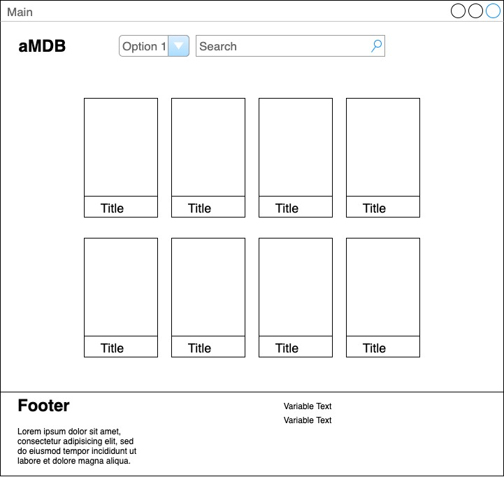
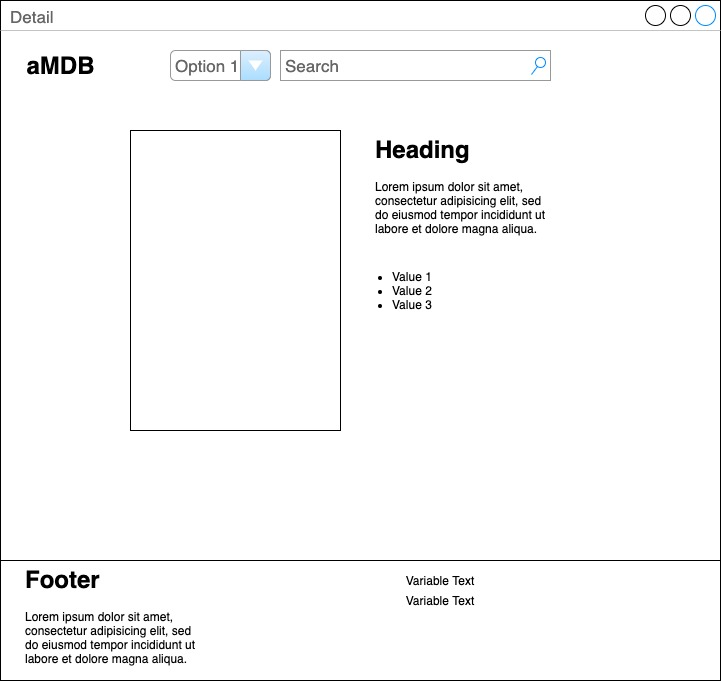

# PROJECT 2 README <!-- omit in toc -->

- [Project Planning](#project-planning)
  - [Overview](#overview)
  - [Wireframes](#wireframes)
  - [MVP](#mvp)
    - [Goals](#goals)
    - [Libraries](#libraries)
    - [Data](#data)
    - [Component Hierarchy](#component-hierarchy)
    - [Component Breakdown](#component-breakdown)
    - [Component Estimates](#component-estimates)
    - [Helper Functions](#helper-functions)
  - [Post-MVP](#post-mvp)
- [Project Delivery](#project-delivery)
  - [Code Showcase](#code-showcase)
  - [Code Issues & Resolutions](#code-issues--resolutions)

## Project Planning

### Overview

**aMDB**

**amDB** is a TV and movie database single page application that allows users to search for a show and see its ratings, reviews, summary, and other details. It also offers lists for what is trending in certain categories and by specific time frames, and a suggestion feature for when you can't decide what to watch.

<br>

### Wireframes



- Main



- Detail

<br>

### MVP

aMDB will offer search functionality to find details about the requested movie or TV series. The focus of this app is on the interactivity of the interface, allowing for a pleasant user experience. It should be responsive, with most components offering dynamic interaction.

<br>

#### Goals

- _Search for movies or tv series_
- _Show trending or popular titles_
- _Search by title or actor_

<br>

#### Libraries

|   Library    | Description                                                           |
| :----------: | :-------------------------------------------------------------------- |
| React Router | _Allow for routing to different pages of the app without page reload_ |
|    Axios     | _Nice library for making HTTP requests_                               |

<br>

#### Data

|    API     | Quality Docs? | Website          | Sample Query                                       |
| :--------: | :-----------: | :--------------- | :------------------------------------------------- |
|    OMDB    |      yes      | _omdbapi.com_    | _http://www.omdbapi.com/?apikeyfdbaa0a9&s=&y=2020_ |
| theMovieDB |      yes      | _themoviedb.org_ | _https://api.themoviedb.org/3/trending/all/week?_  |

```
{
    "Title": "Avatar",
    "Year": "2009",
    "Rated": "PG-13",
    "Released": "18 Dec 2009",
    "Runtime": "162 min",
    "Genre": "Action, Adventure, Fantasy, Sci-Fi",
    "Director": "James Cameron",
    "Writer": "James Cameron",
    "Actors": "Sam Worthington, Zoe Saldana, Sigourney Weaver, Stephen Lang",
    "Plot": "A paraplegic Marine dispatched to the moon Pandora on a unique mission becomes torn between following his orders and protecting the world he feels is his home.",
    "Language": "English, Spanish",
    "Country": "USA",
    "Awards": "Won 3 Oscars. Another 86 wins & 129 nominations.",
    "Poster": "https://m.media-amazon.com/images/M/MV5BMTYwOTEwNjAzMl5BMl5BanBnXkFtZTcwODc5MTUwMw@@._V1_SX300.jpg",
    "Ratings": [
        {
            "Source": "Internet Movie Database",
            "Value": "7.8/10"
        },
        {
            "Source": "Rotten Tomatoes",
            "Value": "82%"
        },
        {
            "Source": "Metacritic",
            "Value": "83/100"
        }
    ],
    "Metascore": "83",
    "imdbRating": "7.8",
    "imdbVotes": "1,091,877",
    "imdbID": "tt0499549",
    "Type": "movie",
    "DVD": "N/A",
    "BoxOffice": "N/A",
    "Production": "N/A",
    "Website": "N/A",
    "Response": "True"
}
```

<br>

#### Component Hierarchy

```
src
|__ assets/
      |__ data-tests
      |__ mockups
|__ components/
      |__ header/
            |__ header.component.jsx
            |__ header.styles.jsx
      |__ footer/
            |__ footer.component.jsx
            |__ footer.styles.jsx
      |__ search/
            |__ search.component.jsx
            |__ search.styles.jsx
|__ pages/
      |__ main/
            |__ main.component.jsx
            |__ main.styles.jsx
      |__ trending/
            |__ trending.component.jsx
            |__ trending.styles.jsx
      |__ detail/
            |__ detail.component.jsx
            |__ detail.styles.jsx
```

<br>

#### Component Breakdown

| Component |    Type    | State | Props | Description                                                                |
| :-------: | :--------: | :---: | :---: | :------------------------------------------------------------------------- |
|  Header   | functional |   n   |   n   | _The header will contain the navigation and logo._                         |
|   Main    | functional |   y   |   n   | _The main will be the landing page and display the current data in state._ |
| Trending  | functional |   n   |   y   | _Trending will fetch and show the currently trending series_               |
|  Search   | functional |   n   |   y   | _Search will be in the header component and will fetch data_               |
|  Detail   | functional |   n   |   y   | _Detail will render specific detail about the selected series_             |
|  Footer   | functional |   n   |   n   | _The footer will show info about me and a link to my portfolio._           |

<br>

#### Component Estimates

| Task         | Priority | Estimated Time | Time Invested | Actual Time |
| ------------ | :------: | :------------: | :-----------: | :---------: |
| CSS          |    H     |     10 hrs     |      TBD      |     TBD     |
| UI Interface |    H     |     10 hrs     |      TBD      |     TBD     |
| Search       |    H     |     7 hrs      |      TBD      |     TBD     |
| Routing      |    H     |     2 hrs      |      TBD      |     TBD     |
| HTML         |    H     |      1 hr      |      TBD      |     TBD     |
| TOTAL        |          |     6 hrs      |     3 hrs     |     TBD     |

<br>

#### Helper Functions

|  Function  | Description                                 |
| :--------: | :------------------------------------------ |
| Form Input | _A custom hook for controlling form inputs_ |

<br>

### Post-MVP

- _Add user account and auth capabilities._
- _Add a watch list._

<br>

---

## Project Delivery

### Code Showcase

```
code snippet here
```

### Code Issues & Resolutions
